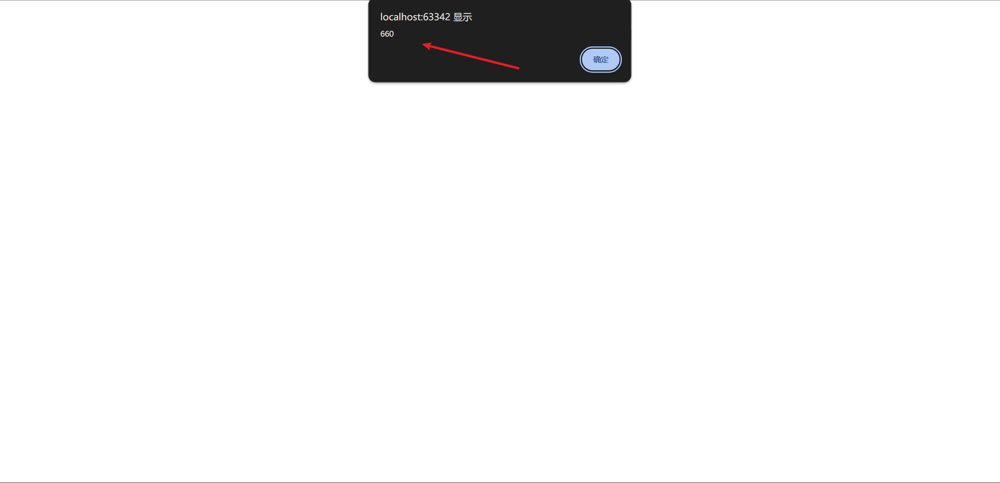
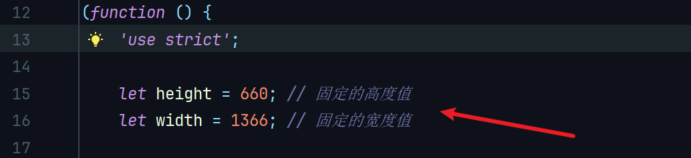
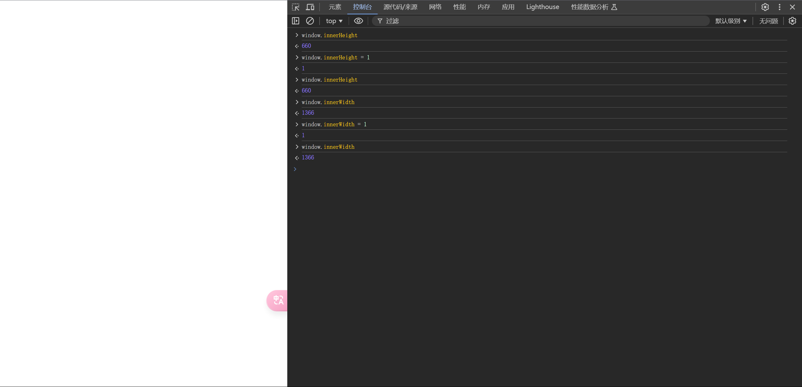

# Fixed_window_size

本项目下的脚本可固定浏览器高度(`window.innerHeight`)和宽度(`window.innerWidth`)值。

## 项目介绍

脚本描述：js获取浏览器高度或宽度时获取到的是脚本中设置的固定值，如果网站js尝试去设置高度和宽度值会直接去设置固定值，并不会按照网站js设置的值去设置。

注意事项：
1. 运行时期依旧为`document-start`

2. 该脚本设置的高度和宽度默认值是按照我浏览器未打开Devtools的值设置的，`window.innerHeight`：

`window.innerWidth`:

使用时可自行更改：

在打开Devtools的前提下未Hook和已Hook的效果图：

